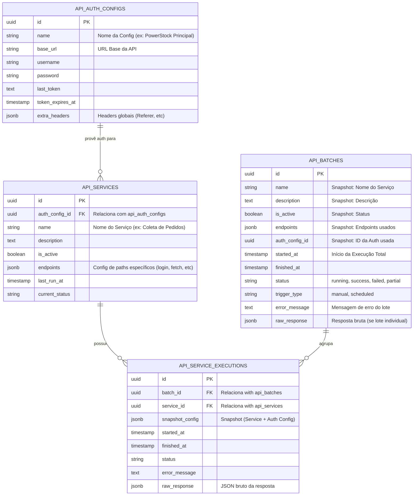

# Modelo de Entidade e Relacionamento (ERD) - Integração de APIs

Este documento descreve a estrutura de dados implementada para a gestão de serviços de integração via API, focando na rastreabilidade, auditoria (logs com JSON bruto) e facilidade de manutenção.

## Diagrama Conceitual (Mermaid)

## Descrição das Tabelas

### 1. api_auth_configs
Armazena as credenciais e a URL base. Esta tabela permite que você tenha um único login/token compartilhado por vários serviços diferentes (ex: um serviço para pedidos, outro para produtos, ambos usando a mesma autenticação).

### 2. api_services
Define o que o serviço faz. Ele aponta para uma configuração de autenticação e define quais `endpoints` (caminhos relativos e métodos HTTP) ele utiliza.

### 3. api_batches
Representa a "Execução Total". Um lote agrupa várias execuções de serviços que foram disparadas juntas.

### 4. api_service_executions
Registra o histórico individual de cada serviço. O `snapshot_config` salva tanto os dados do serviço quanto os dados da autenticação no momento exato da execução.

---
**Documento gerado em:** 2026-04-28
**Versão:** 1.0
