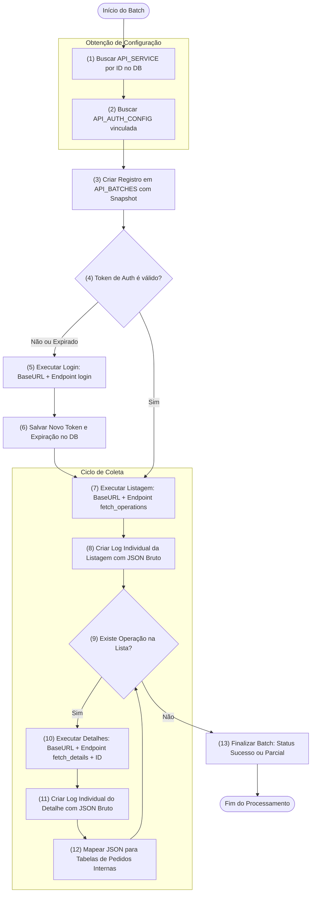

# Fluxo de Integração PowerStock (Listagem e Detalhes)

Este documento descreve a lógica de processamento para a coleta de dados da API do PowerStock, detalhando como as conexões e endpoints são obtidos a partir do banco de dados.

## Fluxo de Processamento (Mermaid)

## Detalhes da Lógica de Configuração

### 1. Obtenção da Conexão
Diferente de uma conexão estática, o serviço agora é dinâmico:
- **Identificação**: O processo recebe um `service_id`.
- **Auth Config**: Através desse ID, o sistema busca na tabela `api_auth_configs` a `base_url`, as credenciais (`username`/`password`) e os headers globais (como o `Referer`).

### 2. Seleção de Endpoints
Os caminhos das APIs não estão "hardcoded" no código. Eles são lidos do campo JSONB `endpoints` da tabela `api_services`. O serviço busca as chaves específicas:
- `login`: Caminho para autenticação.
- `fetch_operations`: Caminho para listar as operações pendentes.
- `fetch_details`: Caminho para obter os itens de uma operação específica (usando o ID retornado na listagem).

### 3. Snapshot e Rastreabilidade
Ao iniciar o lote (`api_batches`), o sistema realiza um "JOIN" virtual e salva uma cópia de toda essa configuração (Auth + Service + Endpoints). Isso garante que, se alguém alterar a URL ou o path no futuro, o log de hoje ainda mostrará exatamente o que foi tentado.

---
**Documento atualizado em:** 2026-04-28
**Versão:** 1.1 (Convertido para Fluxograma)
