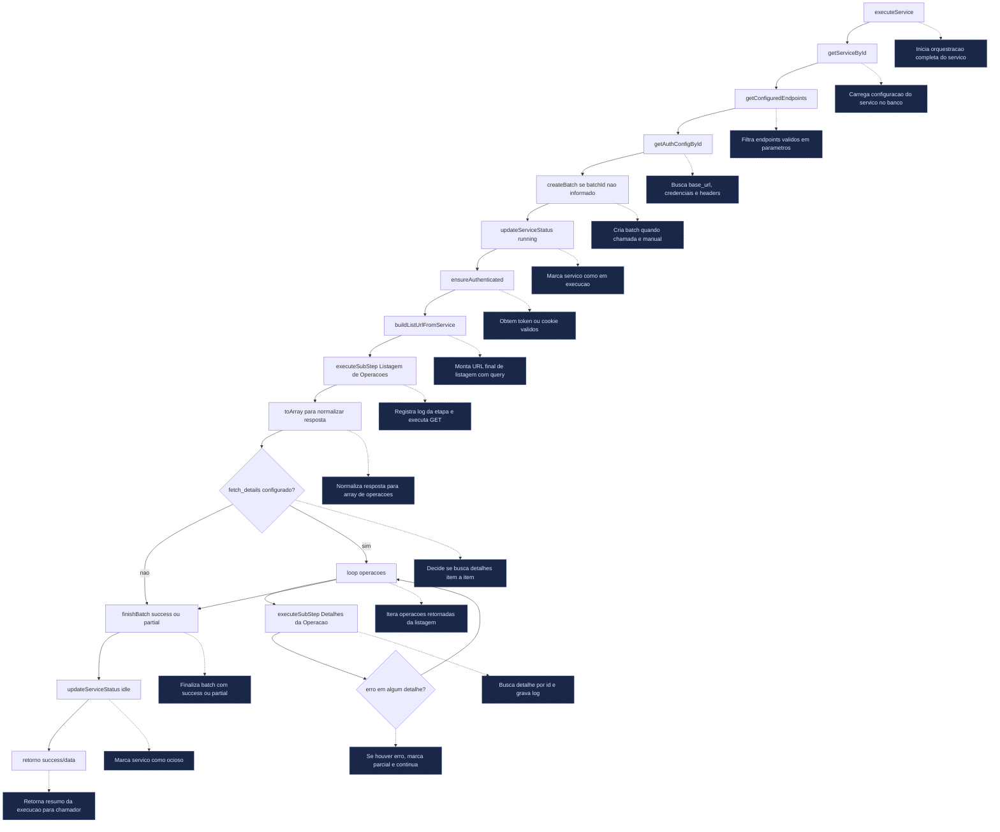

# Fluxo de Execucao - PowerStockGetOperationsService

Este documento descreve, em ordem de execucao, o fluxo das funcoes do arquivo `api/src/services/PowerStockGetOperationsService.ts`.

## Visao Geral

- Classe principal: `PowerStockGetOperationsService`
- Metodo de entrada: `executeService(serviceId, batchId?)`
- Objetivo: autenticar na API PowerStock, buscar listagem de operacoes e (opcionalmente) buscar detalhes por operacao, registrando logs de execucao por etapa.

## Sequencia Principal (Mermaid)

## Ordem das Funcoes Internas

### 1) `executeService(serviceId, batchId?)`

Responsabilidades:
- Carrega `service` via repositorio.
- Monta mapa de endpoints a partir de `service.endpoints` ou `service.parametros`.
- Carrega configuracao de autenticacao (`auth_config_id`).
- Cria batch (quando nao vier `batchId` externo).
- Marca status do servico como `running`.
- Garante sessao autenticada (`ensureAuthenticated`).
- Monta endpoint de listagem:
  - Prioridade 1: `endpoint_url + get_params` (`buildListUrlFromService`)
  - Prioridade 2: endpoint `fetch_operations` em `parametros/endpoints`
- Executa listagem via `executeSubStep`.
- Normaliza lista retornada com `toArray`.
- Se existir `fetch_details`, itera operacoes e busca detalhe por ID (`:id` ou `{id}`).
- Finaliza batch com `success` ou `partial`.
- Marca servico como `idle` ao finalizar com sucesso parcial/total.
- Em erro global, marca servico como `error`, finaliza batch como `failed` e retorna `{ success: false }`.

### 2) `getConfiguredEndpoints(service)`

Responsabilidades:
- Le o objeto de configuracao em `service.endpoints` ou `service.parametros`.
- Filtra somente entradas no formato `ApiEndpointConfig` (`path` + `method` valido).
- Retorna mapa tipado dos endpoints configurados.

### 3) `buildListUrlFromService(service)`

Responsabilidades:
- Usa `service.endpoint_url` como base da listagem.
- Se houver `service.get_params`, monta query string via util:
  - `buildQueryStringFromGetParams(...)`
  - `mergeUrlWithQuery(...)`
- Para parametros de data do PowerStock, aplica regra do util:
  - `dataEmissaoInicio` -> inicio do dia local convertido para ISO UTC
  - `dataEmissaoFim` -> fim do dia local convertido para ISO UTC
- Se nao houver `get_params`, usa fallback legado de `parametro_get` texto.

### 4) `ensureAuthenticated(auth, service)`

Responsabilidades:
- Reaproveita token salvo se ainda valido (`last_token` + `token_expires_at`).
- Se nao houver token valido, faz login em `auth.base_url`:
  - Tentativa 1: `executarLogOffSessaoParelela = false`
  - Se `possuiOutraSessaoAtiva` e sem token: espera `1s` e tenta novamente com `true`
- Extrai:
  - `token`
  - `cookie` (a partir de `set-cookie`)
  - `lojaId` (`dados.loja.id`)
- Persiste token em `api_auth_configs` quando presente.
- Retorna sessao (`token`, `cookie`, `lojaId`).

### 5) `executeSubStep(batchId, service, auth, endpoint, session, stepName)`

Responsabilidades:
- Cria um registro em `api_service_executions` com snapshot da etapa.
- Executa chamada HTTP via `callApi`.
- Em sucesso, fecha execucao da etapa com status `success`.
- Em erro, fecha com status `failed` e propaga excecao.

### 6) `callApi(auth, service, endpoint, session)`

Responsabilidades:
- Monta headers base (`Content-Type` + `auth.extra_headers` normalizados).
- Injeta autenticacao/sessao:
  - `Authorization: Bearer ...`
  - `Cookie`
  - `lojaid`
- Resolve URL final (`resolveRequestUrl`).
- Executa `fetch`.
- Em erro HTTP (`!ok`), inclui body na mensagem de excecao.
- Em sucesso:
  - se vazio, retorna `{}`
  - se JSON valido, retorna objeto/array e loga pretty print
  - se nao JSON, retorna texto bruto

### 7) `resolveRequestUrl(auth, service, endpointPath)`

Responsabilidades:
- Se `endpointPath` ja for URL absoluta, usa diretamente.
- Se for relativo:
  - tenta origin de `service.endpoint_url`
  - fallback para origin de `auth.base_url`

### 8) `toArray(value)`

Responsabilidades:
- Normaliza varios formatos de lista para `any[]`:
  - array direto
  - JSON string de array
  - objeto com `$values`
  - objeto com chaves numericas (`"0"`, `"1"`, ...)

## Dependencias Externas

- `ApiServiceRepository`:
  - `getServiceById`
  - `getAuthConfigById`
  - `createBatch`
  - `finishBatch`
  - `createServiceExecution`
  - `finishServiceExecution`
  - `updateServiceStatus`
  - `updateAuthToken`
- Utilitarios de parametros:
  - `buildQueryStringFromGetParams`
  - `mergeUrlWithQuery`

## Resumo de Regras de Negocio no Fluxo

- Listagem usa preferencialmente `endpoint_url + get_params`.
- Suporte legado para `parametro_get` (texto multiline) continua ativo.
- A autenticacao aceita token ou cookie; se os dois faltarem, falha.
- A execucao pode finalizar como:
  - `success`: sem falhas
  - `partial`: falha em algum detalhe, mas fluxo geral continua
  - `failed`: erro global que interrompe o processo

---

Documento atualizado em: 2026-04-30
