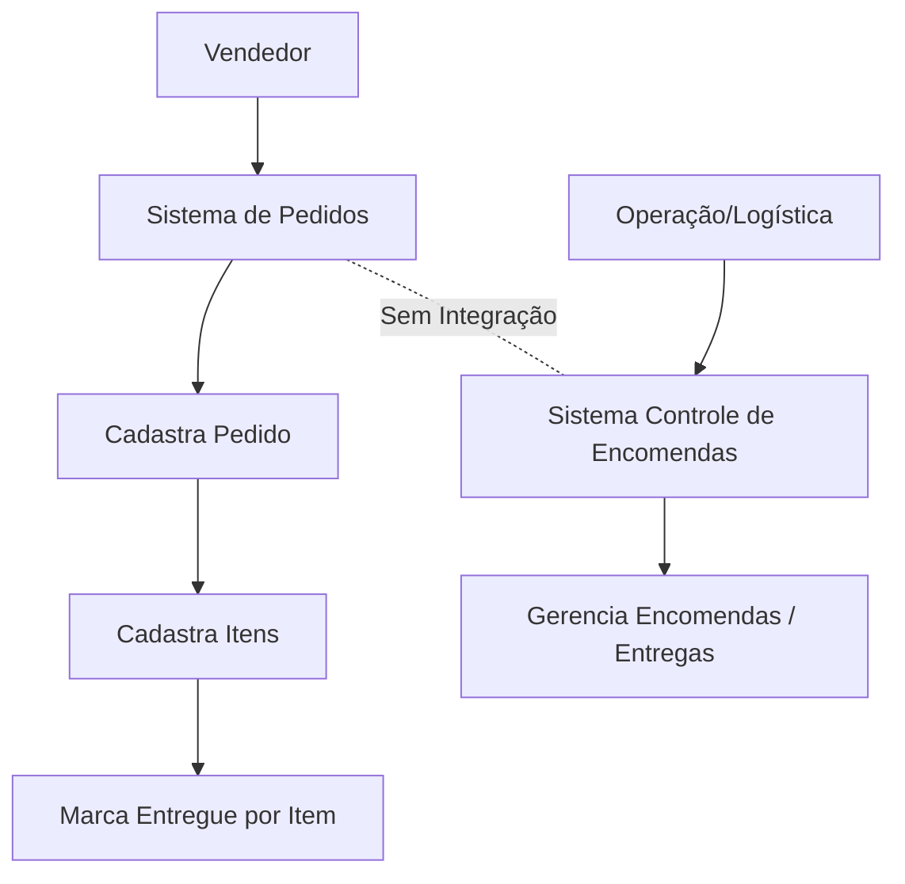

# 01-As Is

## Objetivo
Descrever o processo atual (sem integração) entre:
- Sistema de Pedidos (Vendas)
- Sistema de Controle de Encomendas (Logística/Operação)

## Contexto
- O vendedor registra um pedido e seus itens no Sistema de Pedidos.
- Em cada item, o vendedor indica se foi entregue.
- O Sistema de Controle de Encomendas não “conversa” com o Sistema de Pedidos.
- Hoje não existe um integrador central para sincronizar pedidos e status de entrega.

## Stakeholders e Usuários
- Vendedor: cria pedidos e atualiza status de entrega por item.
- Operação/Logística: usa o Sistema de Controle de Encomendas para acompanhar entregas.
- TI/Suporte: avalia disponibilidade de API no Sistema de Pedidos.

## Dores (Problemas)
- Duplicidade e inconsistência de informação (pedido existe em um sistema e não no outro).
- Acompanhamento de entrega fragmentado.
- Falta de trilha de auditoria centralizada (quando, como, por quem, e via qual mecanismo os dados foram sincronizados).
- Dependência de suporte/terceiros para acessar dados do Sistema de Pedidos (API incerta).

## Fluxo Atual (Mermaid)

## Observações e Restrições
- A existência de API no Sistema de Pedidos ainda está em validação com o suporte.
- Alternativa temporária considerada: captura de pedidos via web scraping.
