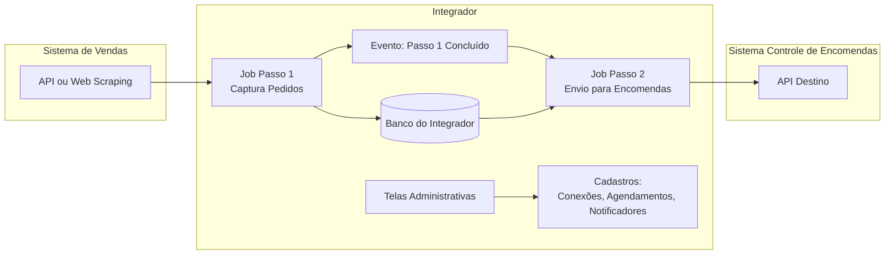

# 02-To Be

## Objetivo
Implantar um Integrador que sincronize pedidos do Sistema de Vendas para o Sistema de Controle de Encomendas, com arquitetura extensível para futuras integrações (ex.: WhatsApp → CRM).

## Visão da Solução
- Um sistema “Integrador” executa dois passos principais:
  - Passo 1: Buscar pedidos no Sistema de Vendas e persistir no banco do Integrador.
  - Passo 2: Ler pedidos do banco do Integrador e enviar para o Sistema de Controle de Encomendas via API.
- Ao terminar uma execução do Passo 1, o Integrador aciona automaticamente “notificadores” (subscritores) configurados para disparar o Passo 2 (e outros no futuro).
- Deve existir UI para:
  - Configurar agendamento dos jobs
  - Disparar job manualmente
  - Consultar histórico de execução (manual vs agendado)
  - Cadastrar conexões e testá-las (banco ou API)
    - Conexão de banco deve ter campo de SQL a executar

## Escopo Inicial (Integração de Pedidos)
- Fonte: Sistema de Vendas
  - Preferencial: API (se disponível)
  - Alternativa: Web scraping (temporário/contingência)
- Destino: Sistema de Controle de Encomendas via API

## Fluxo Proposto (Mermaid)

## Conceitos-Chave
- Conector (Source/Destination): componente que sabe como falar com um sistema externo (API, scraping, banco, etc.).
- Notificador: regra configurável que define quais ações/jobs devem ser disparados ao término de outro job (ex.: ao finalizar Passo 1, disparar Passo 2).
- Execução: instância de rodagem de um job (com status, logs, início/fim, gatilho manual/agendado).

## Critérios de Sucesso (alto nível)
- Pedidos capturados e persistidos no Integrador com rastreabilidade (origem, horário, execução).
- Envio confiável para o sistema de encomendas (retry, idempotência e histórico).
- Operação via UI sem necessidade de intervenção técnica recorrente.
