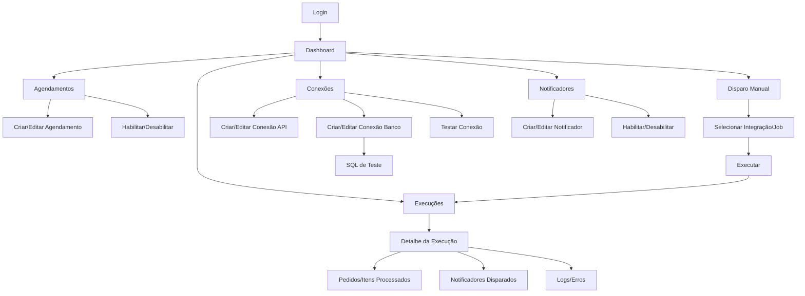

# 04-Fluxo de Arquitetura de Telas

## Mapa de Navegação (alto nível)

## Telas e Estados
- Login
  - Estado: autenticado / não autenticado
- Dashboard
  - KPIs mínimos: execuções nas últimas 24h, falhas, fila, última captura, último envio
- Agendamentos
  - Estados: habilitado/desabilitado; cron válido/inválido; última execução; próxima execução
- Disparo Manual
  - Estados: em execução; concluído; falhou; com parâmetros (ex.: janela de captura, reprocessar falhas)
- Execuções
  - Estados: em fila; rodando; sucesso; falha; cancelado
  - Metadados: manual vs agendado; usuário (se manual); correlationId
- Conexões
  - Tipos: API, Banco
  - Estados: ativa/inativa; teste ok/falha
- Notificadores
  - Estados: habilitado/desabilitado; evento de origem (ex.: Step1 Success); ação destino (ex.: disparar Step2); prioridade; condições

## Papéis de Acesso (mínimo)
- Admin: gerencia conexões, agendamentos, notificadores, usuários.
- Operador: dispara jobs, consulta execuções e detalhes; pode testar conexões se permitido.
