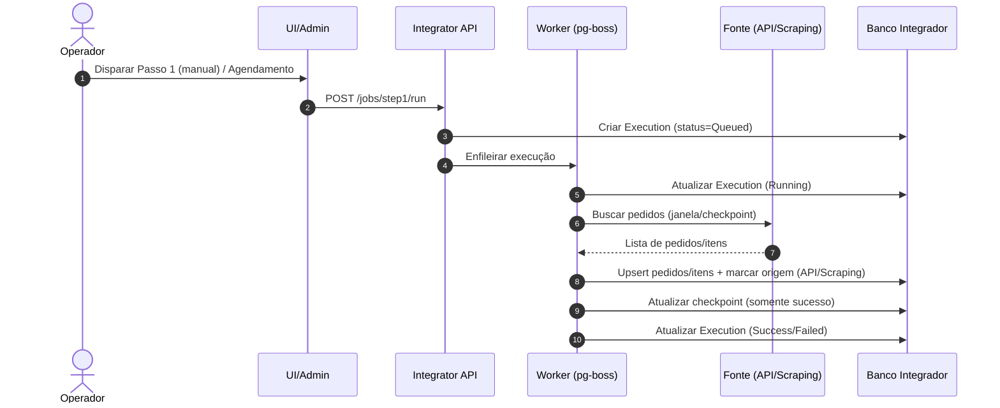
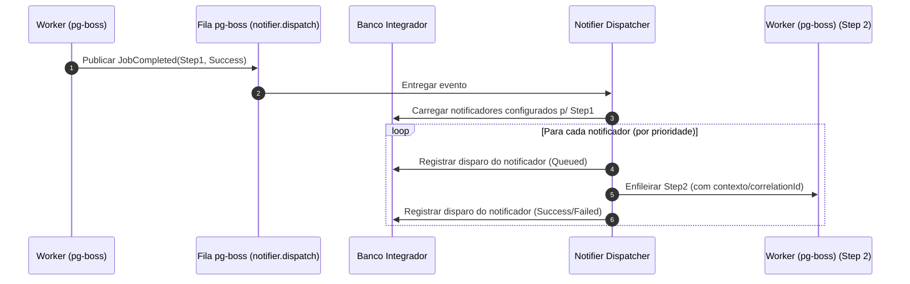
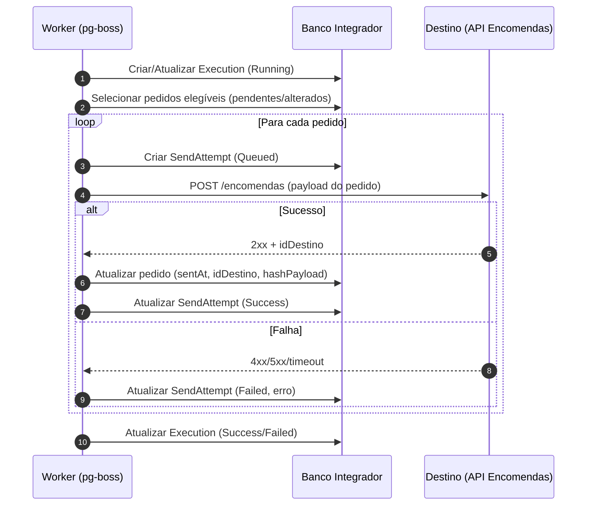

# 05-Fluxo de Processamento de Jobs

## Visão Geral
O Integrador processa integrações por jobs, registrando cada execução e seus resultados. O fluxo padrão inclui:
- Passo 1: Captura (origem → banco Integrador)
- Evento interno: Passo 1 Concluído (sucesso)
- Notificadores: disparam ações configuradas (ex.: Passo 2)
- Passo 2: Envio (banco Integrador → API destino)

As configurações de “quais notificadores disparam após o Passo 1” são mantidas no banco (NotifierConfig) e gerenciadas via tela administrativa de Notificadores.

Implementação alvo:
- Fila/worker usando pg-boss (Postgres)
- Jobs Step1/Step2 e o dispatcher de notificadores como filas separadas
- Lock por (jobType, integrationId) usando advisory locks do Postgres

## Passo 1 — Captura de Pedidos (Sequência)

## Evento Interno — Passo 1 Concluído (Notificadores)

## Passo 2 — Envio para Encomendas (Sequência)

## Controles Necessários (para confiabilidade)
- Lock por integração+job para evitar concorrência (default).
- Idempotência por:
  - chave natural (origem + idPedido) e/ou
  - hash do payload enviado + idDestino
- Retry com backoff e limite; após limite, manter como “falha” reprocessável via UI.
- Rate limit para proteger APIs externas.
